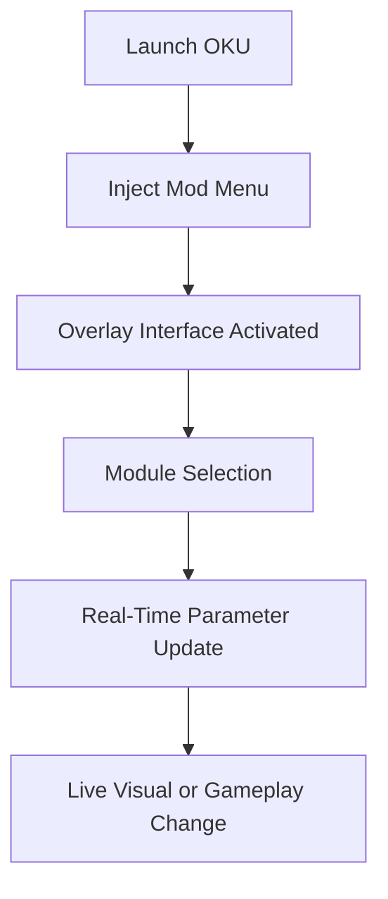

# ⚙️ OKU Mod Menu – Command, Customize, Conquer

The **OKU Mod Menu** gives players the power to reshape gameplay on their own terms. With an advanced in-game overlay, modular customization system, and instant parameter control, this software transforms how you experience OKU — blending precision with total creative freedom.

Whether you’re mastering a boss fight, testing movement physics, or recording cinematic runs, the OKU Mod Menu gives you the flexibility to edit, control, and optimize the game as you play.

---

## 🧩 Overview

The **OKU Mod Menu** is an injected overlay system designed for real-time control and visual feedback. It integrates seamlessly with the game’s core mechanics, allowing users to modify difficulty, visuals, speed, and physics without restarts or reloads.

With intuitive keybinds and adaptive modules, the menu caters to creators, testers, and competitive players alike.

You can:

* Modify energy, stamina, and cooldown timers instantly.
* Toggle cinematic effects or slow-motion for replays.
* Adjust AI difficulty and reaction speed.
* Change environment brightness, fog, and visual tone.
* Save, share, and load your custom mod presets anytime.

---

## 🎮 Key Features

### 🔧 Real-Time Overlay Interface

* Clean, responsive overlay powered by DirectX 12 injection.
* Filter modules by **Combat**, **Environment**, or **System**.
* Switch between compact and extended views with a single key.

### ⚔️ Combat & AI Control

* Adjust player attack rate and invulnerability windows.
* Tune enemy aggression, vision, or patrol radius.
* Enable **Perfect Counter Mode** for reaction training.

```ini
[Combat]
InfiniteEnergy=True
AttackSpeed=1.6
EnemyAggression=Low
SlowMotion=True
ParryAssist=True
```

### 🌌 Visual & Environment Tools

* Custom weather presets (Clear, Dust, Neon, Nightfall).
* Modify FOV, gamma, or dynamic shadows.
* Cinematic replay mode for creators and streamers.

> [!NOTE]
> The overlay UI runs on an independent render layer, ensuring smooth FPS even when multiple visual mods are active.

---

## 💻 Compatibility

| Platform           | Supported | Details                   |
| ------------------ | --------- | ------------------------- |
| Windows 11         | ✅         | DX12 overlay optimized    |
| Windows 10         | ✅         | Stable build              |
| Steam Version      | ✅         | Auto memory detection     |
| Epic Games Version | ⚙️        | Manual injection required |
| Console            | ❌         | Not compatible            |

> [!IMPORTANT]
> Requires **.NET 6.0 Runtime**, **DirectX 12**, and Administrator privileges for successful initialization.

---

## ⚡ Installation & Usage

1. **Download** the latest OKU Mod Menu build.
2. **Extract** to your OKU root directory.
3. Launch the game first, then run `OKUModMenu.exe`.
4. Press `Insert` to open or close the in-game overlay.
5. Customize hotkeys and visual themes via the settings panel.

### Default Hotkeys

| Action             | Key    |
| ------------------ | ------ |
| Toggle Menu        | Insert |
| Toggle Slow Motion | F3     |
| Infinite Energy    | F5     |
| Enemy AI Freeze    | F7     |
| Screenshot Mode    | F9     |

Example config JSON:

```json
{
  "OverlayTheme": "DarkGrid",
  "QuickKeys": {
    "SlowMotion": "F3",
    "InfiniteEnergy": "F5",
    "ScreenshotMode": "F9"
  },
  "RenderFps": 120
}
```

> [!WARNING]
> Disable MSI Afterburner, ReShade, or other overlays before launch to avoid render conflicts.

---

## 🧭 Workflow Diagram



This architecture allows the mod menu to interact directly with OKU’s runtime, producing instant and stable in-game transformations.

---

## ❓ FAQ

**Q: Is the OKU Mod Menu safe?**
A: Yes, it operates completely offline and doesn’t affect your save integrity or online systems.

**Q: Can I use it with custom mods or shaders?**
A: Yes, fully compatible with most external visual mods and shader frameworks.

**Q: Can I make my own modules?**
A: Advanced users can write `.lua` or `.json` extensions in the `/modules` folder for custom tweaks.

**Q: Does it lower FPS?**
A: Negligible impact (<2%), even with multiple effects enabled.

**Q: How often is it updated?**
A: Weekly compatibility patches ensure smooth operation with each new OKU update.

---

## 🏆 Highlights

* Seamless overlay with instant feedback.
* Fully modular and extendable architecture.
* Optimized for creators, testers, and speedrunners.
* Offline-safe — no network hooks or telemetry.
* Stream-friendly with clean visual transitions.

---

## 🧠 Final Thoughts

The **OKU Mod Menu** merges flexibility with control, letting players explore new strategies, styles, and cinematic possibilities without limits. It’s more than a modification system — it’s a sandbox for creativity and precision.

Push the boundaries of gameplay. Adjust, adapt, and ascend.

---

**OKU Mod Menu** – your world, your rules, your perfect play.
